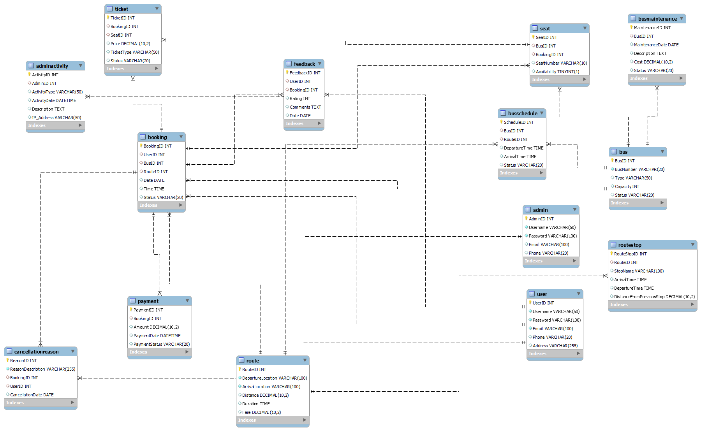

# 🚍 AbhiBus: Transport Management System (SQL-Based)

A real-world **relational database project** designed for a bus transportation company to manage everything from ticket bookings and payments to admin monitoring and maintenance logs.

> 💡 Designed for efficiency. Built for clarity. Developed for real-world readiness.

---

## 📌 Project Description

This project aims to streamline the operations of a bus transport company through a centralized SQL database system. It helps:

- 👥 Users to search for buses, book seats, make payments, and give feedback.
- 🛠️ Admins to manage buses, routes, schedules, tickets, payments, maintenance, and feedback records.

Everything is structured using **15+ normalized tables** ensuring **data integrity** and **efficient querying**.

---

## 💻 Tech Stack

| Tool       | Purpose                          |
|------------|----------------------------------|
| **MySQL**  | Database engine for schema/query |
| **SQL**    | DDL, DML, Joins, Subqueries      |
| **Lucidchart / Draw.io** | ER diagram design         |
| **VS Code / MySQL Workbench** | Development environment |
| **PDF / PowerPoint** | Report & presentation         |

---

## ⚙️ How to Run the Project

1. Open MySQL Workbench, phpMyAdmin, or any SQL IDE.
2. Run the file `dbms_code.sql` to create all tables and insert sample data.
3. Use the provided sample queries or write your own to explore the schema.
4. Refer to `Project-report.pdf` for complete documentation.
5. Use `proj ppt.pdf` if presenting this in an interview or academic setting.

---

## 🧾 Tables Used

The system uses **15+ interrelated tables** including:

- `User` – Stores user data  
- `Bus` – Bus details  
- `Route` – Departure, arrival, fare, distance  
- `Booking` – Links user, bus, and route  
- `Seat` – Seat availability & assignments  
- `Payment` – Amounts, status, timestamps  
- `Feedback` – Ratings and comments  
- `Admin` – Admin user credentials  
- `BusSchedule`, `Ticket`, `Promotion`, `Driver`, `Maintenance`, `AdminActivity`, `RouteStop`, `CancellationReason` – Handle business logic

---

## 📌 ER Diagram

Visualizing entity relationships:

  
*Stored in `er_diagram.png` in this repository.*

---

## 🧠 Sample SQL Queries

```sql
-- 1. View all active buses
SELECT * FROM Bus WHERE Status = 'Active';

-- 2. Get users with only confirmed bookings
SELECT Username FROM User
WHERE UserID IN (
  SELECT UserID FROM Booking WHERE Status = 'Confirmed'
)
AND UserID NOT IN (
  SELECT UserID FROM Booking WHERE Status = 'Cancelled'
);

-- 3. Average ticket price per year
SELECT YEAR(Date) AS Year, AVG(Price) AS AvgPrice
FROM Ticket
JOIN Booking ON Ticket.BookingID = Booking.BookingID
GROUP BY Year;


🧑‍💻 Author
G. Pragnya Reddy
🎓 3rd Year B.Tech – Computer Science & Engineering (Data Science)
